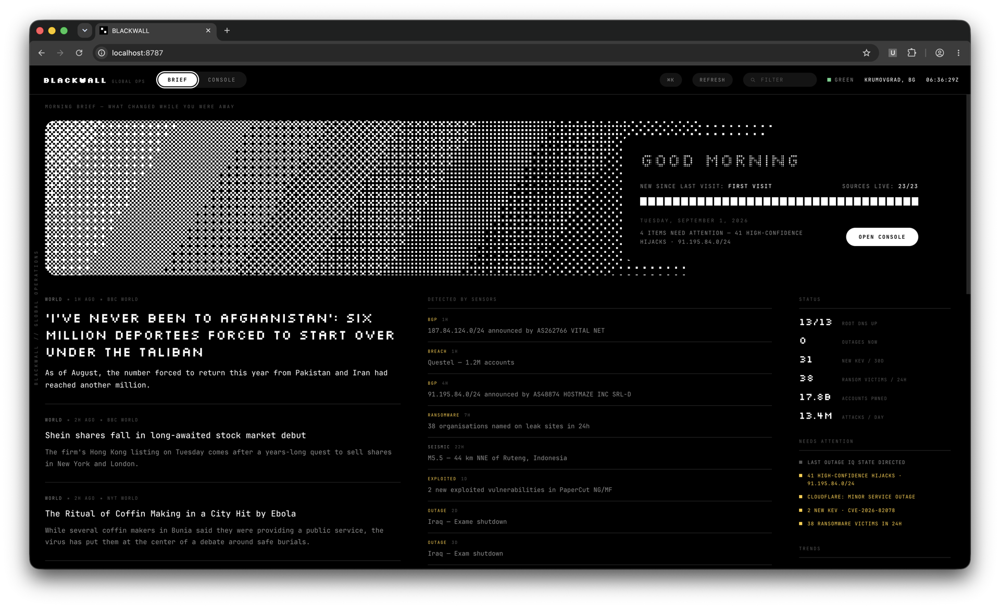
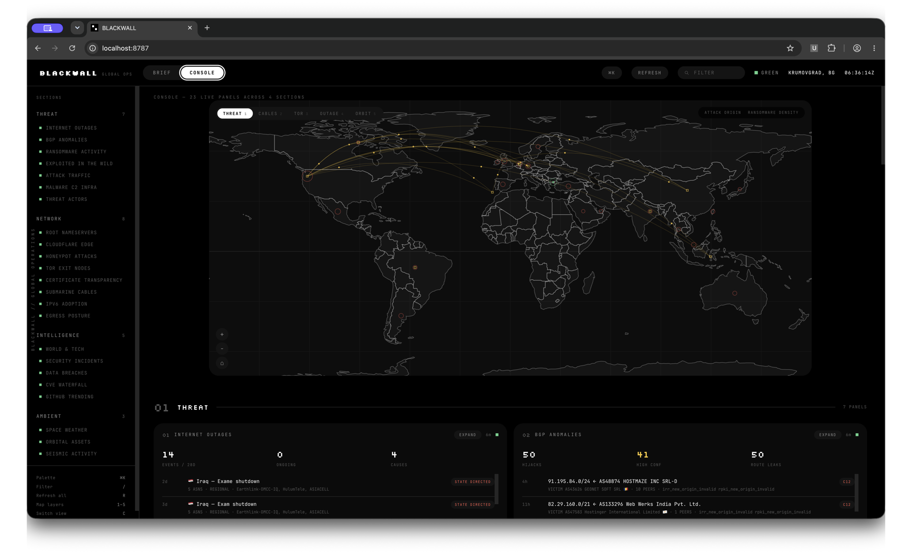
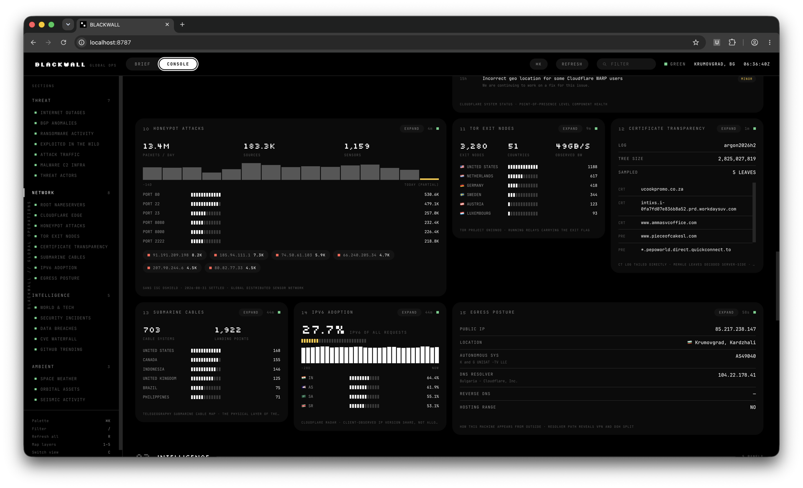
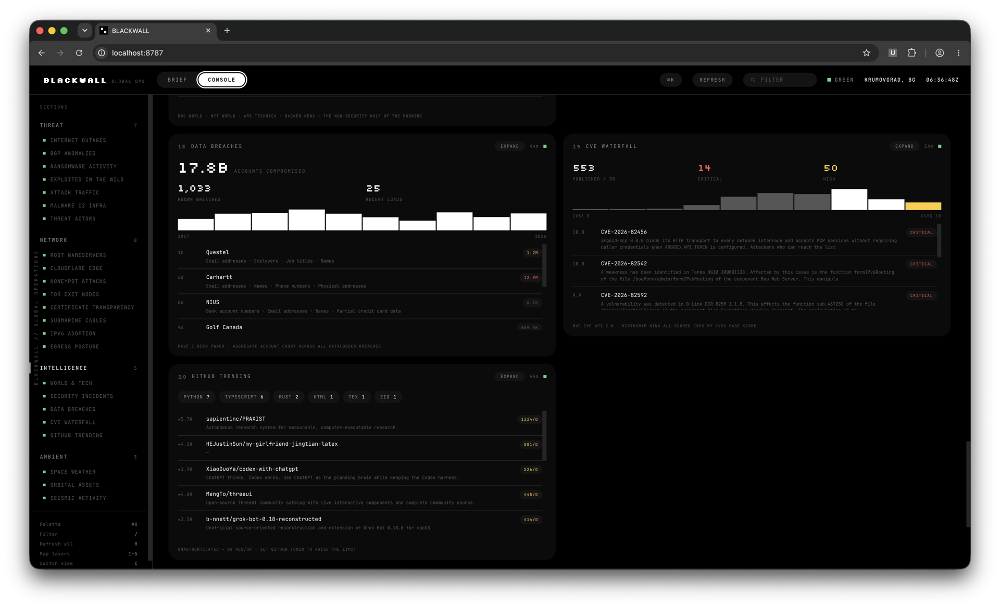

<div align="center">

# BLACKWALL

**A situational-awareness console for the internet itself.**

23 live OSINT sources — attack traffic, BGP hijacks, ransomware leak sites, CVEs,
submarine cables, Tor, root DNS, space weather — on one black-and-white board
that tells you what changed while you were away.

_Zero dependencies. One Node process. No build step._

</div>



---

## Why

Most dashboards answer _"what is the number?"_ Blackwall is built to answer
**"what changed, and does it matter?"**

- **Movement, not absolutes.** Twelve scalars are sampled hourly and kept per
  UTC day for 120 days. "Attacks 14% above the 7-day average" is worth reading
  in a way that "13.4M attacks" is not.
- **A dead source never looks like a healthy one.** Every panel is visibly
  `LOADING`, `NOMINAL`, `STALE` or `FAULT`. A source that silently returns empty
  is the failure mode that matters, so it is the one the design attacks hardest.
- **Nothing is buried.** The brief interleaves items by theme, so the first
  screen always mixes real news with infrastructure events rather than letting
  whichever feed publishes most often crowd out the rest.
- **Built for a keyboard.** Command palette, panel filter, map layers, full-screen
  focus — all reachable without a mouse.

## Two halves

### Brief — what happened while you were away

Shown above. A ranked digest with status figures and anything needing attention.
Items newer than your last visit are badged; the sidebar carries live counters
and derived alerts. Click any alert to jump to the panel responsible.

### Console — the full instrument grid

23 panels across 4 sections, with a labelled sidebar naming every one and a live
status dot beside each. Click a panel header to expand it full-screen — the node
is _moved_, not cloned, so it keeps live-refreshing while focused.







---

## Quick start

### Docker

```bash
docker compose up -d --build     # http://localhost:8787
docker compose logs -f
docker compose down              # add -v to also drop the cache volume
```

Runs as the unprivileged `node` user. `.env` is injected at runtime via
`env_file` and never baked into the image.

The cache lives on the `blackwall-cache` volume, so a restart serves instantly
instead of re-pulling all 23 upstreams. `panels.config.json` is bind-mounted
read-only: edit it on the host and reload the browser, no rebuild needed.

Change the published port with `PORT=9000 docker compose up -d` — the container
always listens on 8787 internally, only the host mapping moves.

The healthcheck allows a 45s grace period because a cold start pulls a 48MB
MITRE ATT&CK bundle.

### Node directly

```bash
npm start            # http://localhost:8787
npm run dev          # same, with auto-restart on server changes
```

Node 20+. **No dependencies** — the HTTP server, the RSS parser, the DER decoder
and the map renderer are all hand-rolled against the standard library. Nothing to
install, nothing to audit, no lockfile to drift.

## Credentials

Every key in `.env` is optional; panels that find one upgrade themselves.

| Key                | Unlocks                                                                 |
| ------------------ | ----------------------------------------------------------------------- |
| `CF_RADAR_TOKEN`   | National internet outages, BGP anomalies, attack traffic, IPv6 adoption |
| `ABUSECH_AUTH_KEY` | ThreatFox IOC feed on top of the Feodo C2 blocklist                     |
| `GITHUB_TOKEN`     | Raises the trending panel from 60 to 5,000 requests/hour                |

Without `CF_RADAR_TOKEN` four panels report `NO TOKEN` rather than failing.

## Using it

Two modes, toggled in the header or with `C`. The mode is remembered, and
`?mode=read` / `?mode=ops` make it linkable.

### Keyboard

| Key             | Action                                                           |
| --------------- | ---------------------------------------------------------------- |
| `⌘K` / `Ctrl+K` | Command palette — jump to a panel, switch map layer, save a view |
| `/`             | Filter panels                                                    |
| `1`–`5`         | Map layer                                                        |
| `R`             | Refresh every panel                                              |
| `G`             | Scroll to top                                                    |
| `M`             | Jump to the map                                                  |
| `C`             | Toggle Brief / Console                                           |
| `Esc`           | Close palette or focused panel                                   |

On the map: arrows pan, `+`/`-` zoom, `0` resets.

### Saved views

A view is your whole vantage point — mode, panel filter, map layer and map
position — under a name you choose. Save and restore them from the command
palette. Your last view is also restored automatically on load.

Views live in `localStorage`, so they are per-browser and scoped to the origin;
changing `PORT` gives you a different origin and a fresh set.

## How it works

### Panel states

Every panel is always in one of four states, visually distinct on purpose:

- **LOADING** — awaiting first response
- **NOMINAL** — fresh
- **STALE** — older than 2× TTL. Desaturated, amber timestamp
- **FAULT** — upstream failed. Hatch fill, last-good data ghosted underneath

### History and trends

A small set of scalars is sampled hourly and kept per UTC day for 120 days in
`.cache/history.json`, exposed at `/api/history`. Writes are atomic — a torn
history file is worse than none. The Trends block reports "Collecting" until at
least two days exist.

### Layout

`panels.config.json` controls what is shown, in what order, at what width. Set
`"on": false` to hide a panel, change `"span"` (1–4) to resize it, reorder the
arrays to rearrange the board. Reload the browser to apply — no restart.

### Adding a source

Drop a file in `server/sources/`. The registry discovers it automatically.

```js
export default {
  id: "mything",
  label: "MY THING",
  ttl: 600, // seconds before a refresh is due
  span: 2, // default grid width
  async fetch({ env, has }) {
    return {
      /* whatever your renderer needs */
    };
  },
};
```

Then add a renderer keyed by the same `id` in `web/panels.js`, returning
`{ body, foot }` built from the primitives in `web/ui.js`, and list the panel in
`panels.config.json`.

## Tests

```bash
npm test             # contract tests against live upstreams + digest unit tests
npm run test:unit    # pure functions only, no network
```

The contract tests deliberately hit the real APIs. Every panel that silently
rendered empty during this build did so because an upstream changed shape, not
because it threw — DShield switched to index-keyed objects, cable landing points
lost their country field, Radar nested hijack prefixes in an array, APNIC began
serving HTML. `test/schema.js` asserts the fields each renderer actually reads,
so drift fails loudly instead of producing a well-formed empty panel.

Verified to catch regressions: reintroducing the original DShield bug turns
`honeypot returns its contracted shape` red.

## Security

The server proxies your API credentials, so it binds **127.0.0.1** by default.
Set `HOST=0.0.0.0` only if you mean to expose it. The container listens on
`0.0.0.0` internally but Compose publishes to the host loopback only.

Every response carries a strict CSP with no `unsafe-inline`, plus `nosniff`,
`no-referrer`, COOP/CORP and a `Permissions-Policy`. Feed URLs are scheme-checked
before they ever reach an `<a href>` or `window.open` — RSS `<link>` elements and
Hacker News submissions are third-party strings, and a `javascript:` URL from a
compromised feed would otherwise run in your origin.

## Accessibility

Clickable rows are real keyboard targets with visible focus rings. Both overlays
are proper modals with focus traps and focus restoration. The map is fully
operable from the keyboard. Motion respects `prefers-reduced-motion`.

## Sources

Cloudflare Radar · Cloudflare Status · SANS ISC DShield · Tor Project Onionoo ·
ransomware.live · Have I Been Pwned · CISA KEV · FIRST EPSS · NVD · CISA /
Krebs / BleepingComputer / The Hacker News RSS · GitHub Search · Google Argon CT
log · abuse.ch Feodo · TeleGeography · the 13 DNS root servers (measured
directly over UDP/53) · MITRE ATT&CK · NOAA SWPC · USGS · wheretheiss.at ·
Celestrak · ipinfo

## Known gaps

- **GPSJam** (GPS interference zones) changed its data layout; every documented
  tile endpoint 404s. Not wired up.
- **Celestrak** throttles repeat pulls to a 2-hour window, so the Starlink count
  reports `RATE LIMITED` between refreshes rather than failing.

## Credits

Design language — pure black and white, pixel/dot-matrix display type, ordered
dithering, block meters, white pill buttons — adapted from interface design work
by **Ilija Roganović**. The reference imagery is not redistributed here; only the
interpretation of it in `web/style.css` is.

Typefaces: [JetBrains Mono](https://github.com/JetBrains/JetBrainsMono) and
[Silkscreen](https://github.com/googlefonts/silkscreen), both under the SIL Open
Font License 1.1. The licence texts ship with the fonts in `web/assets/` — see
[`web/assets/FONTS.txt`](web/assets/FONTS.txt).

## License

MIT — see [LICENSE](LICENSE). The bundled fonts keep their own OFL 1.1 licence;
see [`web/assets/FONTS.txt`](web/assets/FONTS.txt).
